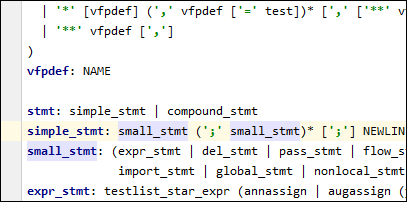
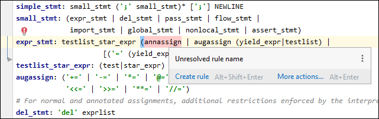
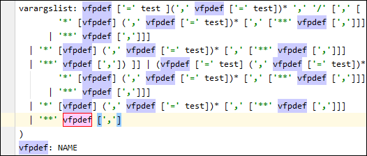

IntelliJ plugin for PEG grammar using Guido's pegen syntax (https://github.com/gvanrossum/pegen)

You only get syntax highlighting for strings and rule names, error highlighting for unresolved 
rule names and go to definition/find usages on rules. Plugin breaks horribly on syntax errors,
has almost no other refactoring support. But it's better than editing black on white text.
I am not good at java or at writing intellij plugins, I made it for myself, but maybe you 
will also find it useful.

This plugin on JetBrains plugin website: https://plugins.jetbrains.com/plugin/13832-pegen

Screenshots:

# how to build

- install gradle plugin for the IDE
- run `gradle package plugin` task from the side explorer
